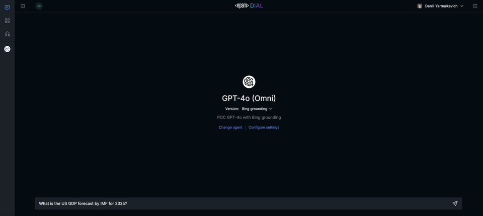

# AI DIAL Bing Grounding

Repository contains DIAL application that implements integration with `Azure AI Agent` with support of 
`Grounding with Bing Search` and `Grounding with Bing Custom Search` tools.

Application addresses the need for web-search enabled agent for **Azure-restricted** environments.

For environments with access to the **GCP** and **Vertex AI** resources, consider using `Gemini 2.5 Pro with Google 
Search Grounding`.



## Deployment of Azure AI Agent with Bing Grounding from scratch

> ℹ️ You can skip creation of resources that already exist in your Azure subscription.

1. Create [Azure AI Foundry Project](https://learn.microsoft.com/en-us/azure/ai-foundry/how-to/create-projects?tabs=ai-foundry&pivots=fdp-project). 
   Note: it must be **Foundry Project**, not **Hub based Project**.
2. Create `GPT 4.1` model deployment in the Azure AI Foundry Project.
3. If `Grounding with Bing Search` is required:
   * Create [Grounding with Bing Search resource](https://learn.microsoft.com/en-us/azure/ai-services/agents/how-to/tools/bing-grounding#setup). 
   * Create [Grounding with Bing Search connection](https://learn.microsoft.com/en-us/azure/ai-services/agents/how-to/tools/bing-code-samples?pivots=portal)
4. If `Grounding with Bing Custom Search` is required:
   * Create [Bing Custom Search resource](https://learn.microsoft.com/en-us/azure/ai-foundry/agents/how-to/tools/bing-custom-search#setup).
   * Create [Grounding with Bing Custom Search connection](https://learn.microsoft.com/en-us/azure/ai-foundry/agents/how-to/tools/bing-custom-search-samples?pivots=portal).
5. Create managed identity for the application. Assign the ["Azure AI Developer"](https://learn.microsoft.com/en-us/azure/role-based-access-control/built-in-roles/ai-machine-learning#azure-ai-developer) role to the identity.

See also the [API documentation](https://learn.microsoft.com/en-us/python/api/overview/azure/ai-projects-readme?view=azure-python-preview) 
for Azure AI project client Python library.

## Environment Variables

| Variable                    | Required | Description                                                            | Available Values                      | Default Value |
|-----------------------------|----------|------------------------------------------------------------------------|---------------------------------------|---------------|
| AZURE_AI_PROJECT_ENDPOINT   | Yes      | Azure AI Foundry Project endpoint. Can be found in `Overview` section. |                                       |               |
| BING_CONNECTION_NAME        | Yes      | Name of the Bing connection in Azure AI Project.                       |                                       |               |
| BING_CUSTOM_CONNECTION_NAME | No       | Name of the Bing Custom Search connection in Azure AI Project.         |                                       |               |
| BING_CUSTOM_CONFIGURATION   | No       | Optional default configuration name for Bing Custom Search connection. |                                       |               |
| LOG_LEVEL                   | No       | Log level. Use DEBUG for dev purposes and INFO in prod.                | DEBUG, INFO, WARNING, ERROR, CRITICAL | INFO          |
| DIAL_SDK_LOG                | No       | Log level for DIAL SDK. Use DEBUG for dev purposes and INFO in prod.   | DEBUG, INFO, WARNING, ERROR, CRITICAL | INFO          |
| WEB_CONCURRENCY             | No       | Number of workers for the server.                                      | Integer                               | 2             |

> ℹ️ For development: copy `.env.example` to `.env` and customize it for your environment.

## DIAL Model Configuration

Example configuration for the DIAL model:

```json
{
  "models": {
    "azure-ai-agent-bing-search-gpt-4.1": {
      "displayName": "Azure AI Agent with Bing Search",
      "description": "Azure AI Agent with Grounding with Bing Search connection.",
      "descriptionKeywords": [
        "Web Search",
        "Bing Search Grounding"
      ],
      "iconUrl": "gpt4.svg",
      "endpoint": "http://dial-bing-grounding.dial-development.svc.cluster.local.:80/openai/deployments/gpt-4.1/chat/completions",
      "features": {
        "configurationEndpoint": "http://dial-bing-grounding.dial-development.svc.cluster.local.:80/openai/deployments/gpt-4.1/configuration",
        "systemPromptSupported": true
      },
      "upstreams": [
        {
          "extraData": {}
        }
      ]
    },
    "azure-ai-agent-bing-custom-search-gpt-4.1": {
      "displayName": "Azure AI Agent with Bing Custom Search",
      "description": "Azure AI Agent with Grounding with Bing Custom Search connection.",
      "descriptionKeywords": [
        "Web Search",
        "Bing Custom Search Grounding"
      ],
      "iconUrl": "gpt4.svg",
      "endpoint": "http://dial-bing-grounding.dial-development.svc.cluster.local.:80/openai/deployments/gpt-4.1/chat/completions",
      "features": {
        "configurationEndpoint": "http://dial-bing-grounding.dial-development.svc.cluster.local.:80/openai/deployments/gpt-4.1/configuration",
        "systemPromptSupported": true
      },
      "defaults": {
        "custom_fields": {
          "configuration": {
            "custom_search_configuration": "official-data-only"
          }
        }
      },
      "upstreams": [
        {
          "extraData": {}
        }
      ]
    }
  }
}
```

> ⚠️ **Important:**  
> The deployment names in `endpoint` and `configurationEndpoint` **must exactly match** the model deployment name in your Azure OpenAI Service.  
> The example above uses `gpt-4.1` as the deployment name.

## Deployment Configuration

> ℹ️ This section does not require any actions, it is provided for reference.

The app deployment has the following configuration schema which is returned by [DIAL configuration endpoint](https://dialx.ai/dial_api#operation/configurationDeployment).

```json
{
  "title": "BingGroundingConfiguration",
  "type": "object",
  "properties": {
    "thread_management_strategy": {
      "description": "Strategy for managing threads. 'retain' keeps threads, 'delete' removes them after use.",
      "default": "delete",
      "allOf": [
        {
          "$ref": "#/definitions/ThreadManagementStrategy"
        }
      ]
    },
    "custom_search_configuration": {
      "title": "Custom Search Configuration",
      "description": "Bing Custom Search configuration name",
      "type": "string"
    }
  },
  "definitions": {
    "ThreadManagementStrategy": {
      "title": "ThreadManagementStrategy",
      "description": "An enumeration.",
      "enum": [
        "retain",
        "delete"
      ],
      "type": "string"
    }
  }
}
```

Example of request body with configuration:
```json
{
  "messages": [
    {
      "role": "user",
      "content": "What's the US GDP forecast for 2025 by IMF?"
    }
  ],
  "custom_fields": {
    "configuration": {
      "thread_management_strategy": "retain"
    }
  }
}
```

## Developer environment

This project uses [Python>=3.11](https://www.python.org/downloads/) and [Poetry>=1.6.1](https://python-poetry.org/) as a dependency manager.

Check out Poetry's [documentation on how to install it](https://python-poetry.org/docs/#installation) on your system before proceeding.

To install requirements:

```sh
poetry install
```

This will install all requirements for running the package, linting, formatting and tests.

### IDE configuration

The recommended IDE is [VSCode](https://code.visualstudio.com/).
Open the project in VSCode and install the recommended extensions.

The VSCode is configured to use PEP-8 compatible formatter [Black](https://black.readthedocs.io/en/stable/index.html).

Alternatively you can use [PyCharm](https://www.jetbrains.com/pycharm/).

Set-up the Black formatter for PyCharm [manually](https://black.readthedocs.io/en/stable/integrations/editors.html#pycharm-intellij-idea) or
install PyCharm>=2023.2 with [built-in Black support](https://blog.jetbrains.com/pycharm/2023/07/2023-2/#black).

### Make on Windows

As of now, Windows distributions do not include the make tool. To run make commands, the tool can be installed using
the following command (since [Windows 10](https://learn.microsoft.com/en-us/windows/package-manager/winget/)):

```sh
winget install GnuWin32.Make
```

For convenience, the tool folder can be added to the PATH environment variable as `C:\Program Files (x86)\GnuWin32\bin`.
The command definitions inside Makefile should be cross-platform to keep the development environment setup simple.

## Run

Run the development server locally:

```sh
make serve
```

Run the development server in Docker:

```sh
make docker_serve
```

Open `localhost:5001/docs` to make sure the server is up and running.

## Lint

Run the linting before committing:

```sh
make lint
```

To auto-fix formatting issues run:

```sh
make format
```

## Test

Run unit tests locally:

```sh
make test
```

Run unit tests in Docker:

```sh
make docker_test
```

Run integration tests locally:

```sh
make integration_tests
```

## Clean

To remove the virtual environment and build artifacts:

```sh
make clean
```

## Build docs

> ℹ️ for user libraries like SDK

To build the docs:

```sh
make docs
```

## Publish

> ℹ️ for user libraries like SDK

To publish the package to PyPI:

```sh
make publish
```